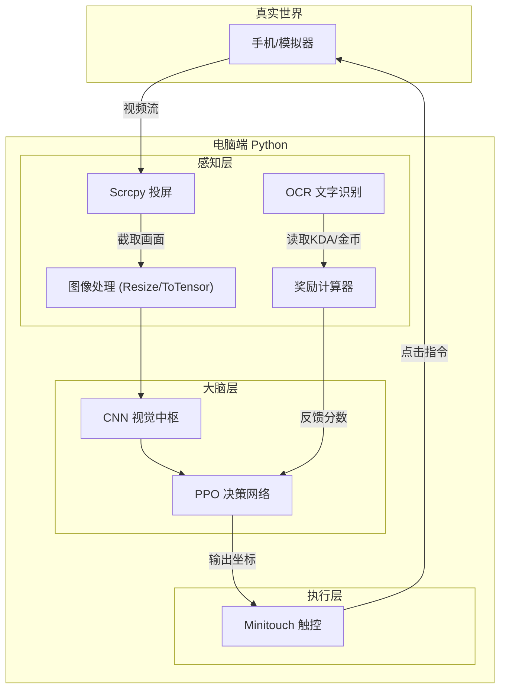

# 00. 王者荣耀 AI：它是怎么学会打游戏的？

欢迎来到 **Auto-WZRY** 项目！本文档将用最通俗的语言，带你理解我们是如何训练一个“会打王者荣耀”的 AI 的。

---

## 1. 核心原理：像教宠物一样教 AI

强化学习 (Reinforcement Learning, RL) 听起来很深奥，其实原理和**训练宠物**非常像。

在这个项目中，我们把 AI 看作一只**刚出生的“电子宠物”**：

1.  **眼睛 (Observation)**: 
    *   它通过 **Scrcpy** 实时获取手机屏幕的画面。
    *   就像我们看屏幕一样，它每秒看几十张图片。
2.  **大脑 (Model)**:
    *   这是一个 **神经网络 (CNN + Actor-Critic)**。
    *   它负责分析画面（哪里有人？血量多少？），并决定下一步做什么。
3.  **手 (Action)**:
    *   它通过 **Minitouch/ADB** 模拟手指在屏幕上的点击和滑动。
    *   它可以控制英雄移动、放技能、普攻。
4.  **老师 (Reward)**:
    *   这是最关键的部分。AI 一开始不知道什么是“好”，我们需要定义**奖励**。
    *   **击杀敌人、推塔、获得金币** -> 给它一颗“糖” (+分)。
    *   **被击杀、撞墙、挂机** -> 打一下“手心” (-分)。
    *   AI 的终极目标就是：**为了吃到更多的糖，努力玩好游戏。**

---

## 2. 系统架构思维导图

为了实现上述过程，我们的代码结构如下：

---

## 3. 大脑解密：AI 是如何思考的？

我们常说的“神经网络”其实包含两个核心部分，它们分工明确，配合默契。代码实现主要在 `main/model.py` 中。

### 3.1 视觉中枢 (CNN Encoder) —— AI 的“超级眼镜”
*   **输入**: 手机屏幕画面 (224x224 像素的图片)。
*   **工作**: 
    *   图片对电脑来说只是一堆数字矩阵。
    *   **CNN (卷积神经网络)** 的作用就像一副“超级眼镜”，能把这些数字转换成**有意义的信息**（特征向量）。
    *   我们在代码中使用了工业级的 **ResNet18** 架构。它能识别出画面中的线条、形状、纹理，最终告诉大脑：“左上角有敌人”、“血条空了”、“塔在攻击我”。
*   **输出**: 一个包含 512 个数字的特征向量（可以理解为对当前局势的“摘要”）。

### 3.2 决策中枢 (PPO Actor-Critic) —— AI 的“双核大脑”
拿到画面摘要后，PPO 算法会启动两个“人格”来共同决策：

1.  **演员 (Actor) —— 负责“动”**
    *   它根据画面摘要，决定手该怎么动。
    *   **输出**: 比如 `(0.5, 0.8)`，代表手指点击屏幕的具体位置。
    *   *特点*: 它不仅输出位置，还会输出一个“自信程度”。刚开始训练时它很犹豫（乱点），随着奖励增加，它会越来越自信。

2.  **评论家 (Critic) —— 负责“评”**
    *   它不直接操作，而是像一个**场外教练**，时刻评估现在的局势好不好。
    *   **输出**: 一个分数 (Value)。比如看到自己满血且敌方残血，它会打高分；如果被塔打了，它会打低分。
    *   *作用*: 它的打分会反过来指导“演员”。如果“演员”做了一个动作导致分数变高，“评论家”就会夸奖它：“刚才做得好，下次还这么干！”

---

## 4. 训练流程：从“小白”到“大神”

要把一个只会乱点的 AI 训练成高手，通常分三步走：

### 第一阶段：环境搭建 (搭积木)
*   **目标**: 让电脑能“看到”手机画面，能“控制”手机操作。
*   **对应代码**: `main/env/` (adb_wrapper, scrcpy_wrapper)。
*   **现状**: ✅ 已完成。

### 第二阶段：模仿学习 (上小学)
*   **原理**: AI 一开始太笨了，如果让它自己乱试，可能玩一万局都学不会走直线。
*   **做法**: **人类高手亲自玩**，录制下来。让 AI 看着录像学：“哦，原来看到残血要按这个技能”。
*   **术语**: **行为克隆 (Behavior Cloning, BC)**。
*   **对应代码**: 
    *   `main/record_expert.py` (录像)
    *   `main/train_bc.py` (学习)
*   **现状**: ✅ 框架已搭建，等待您录制数据。

### 第三阶段：强化学习 (上大学)
*   **原理**: 师傅领进门，修行在个人。模仿人类只能达到人类的水平，想要超越，就得靠自己悟。
*   **做法**: AI 开始自己控制游戏，不断尝试新的操作。虽然偶尔会犯错，但只要做对了（比如一次漂亮的五杀），它就会记下来并强化这个行为。
*   **术语**: **PPO 算法 (Proximal Policy Optimization)**。
*   **对应代码**: `main/train.py`。
*   **现状**: ✅ 核心算法已就绪。

---

## 5. 总结

我们现在的进度正处于 **第二阶段** 和 **第三阶段** 的交界处。
*   你可以先用 **录制器** 玩几把，教 AI 基础操作。
*   然后运行 **训练脚本**，看着它一点点变强。

这就是**王者荣耀强化学习**的全部奥秘！
