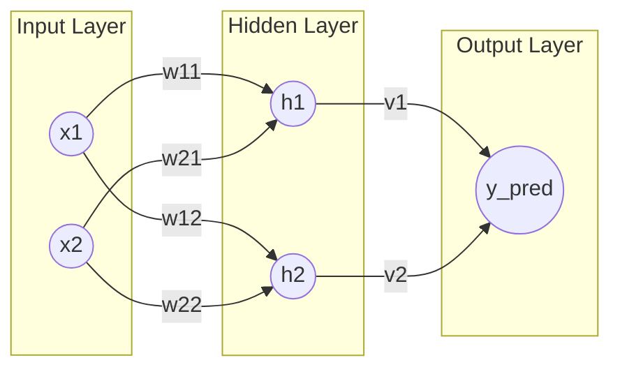

# 08. 硬核推导：手算神经网络的反向传播

> **警告**：本文包含大量数学公式（主要是中学/大一水平的微积分）。
> 如果你对数学过敏，可以只运行 `main/debug/hand_craft_backprop.py` 感受结果。
> 但如果你想真正理解 AI 的底层逻辑，请坚持读完。

---

## 1. 我们的实验模型

为了演示清楚，我们构建一个极简的 3 层神经网络：

*   **输入层 (Input Layer)**: 2 个神经元 ($x_1, x_2$)
*   **隐藏层 (Hidden Layer)**: 2 个神经元 ($h_1, h_2$)，使用 Sigmoid 激活函数。
*   **输出层 (Output Layer)**: 1 个神经元 ($y_{pred}$)，线性输出。

### 结构图 (带权重标注)

为了让你不再懵逼，我们把权重 $w$ 标在连线上：

### 数学符号定义

**1. 输入**: $X = [x_1, x_2]$

**2. 权重矩阵 1**: $W_1$ (连接 Input -> Hidden)

这里的 $W_1$ 其实就是把上面图里的 4 条红线（权重）打包成一个矩阵。
*   **第 1 行**对应 $x_1$ 发出的两条线 ($w_{11}, w_{12}$)
*   **第 2 行**对应 $x_2$ 发出的两条线 ($w_{21}, w_{22}$)

$$
W_1 = \begin{bmatrix} w_{11} & w_{12} \\ w_{21} & w_{22} \end{bmatrix}
$$

*   $w_{11}$: 连接 $x_1 \to h_1$
*   $w_{12}$: 连接 $x_1 \to h_2$
*   $w_{21}$: 连接 $x_2 \to h_1$
*   $w_{22}$: 连接 $x_2 \to h_2$

**3. 权重矩阵 2**: $W_2$ (连接 Hidden -> Output)

$$
W_2 = \begin{bmatrix} v_1 \\ v_2 \end{bmatrix}
$$

**4. 真值**: $y_{target}$

---

## 2. 前向传播 (Forward Pass)

假设我们有具体数值：
*   $X = [0.5, 0.1]$
*   $W_1 = [[0.1, 0.2], [0.3, 0.4]]$
*   $W_2 = [[0.5], [0.6]]$
*   $y_{target} = 0.8$

### 第一步：计算隐藏层

我们先算出隐藏层的原始值 $h_{raw}$，然后通过激活函数 Sigmoid。

$$
h_{raw} = X \cdot W_1 = [0.5, 0.1] \cdot \begin{bmatrix} 0.1 & 0.2 \\ 0.3 & 0.4 \end{bmatrix} 
$$

$$
h_{raw_1} = 0.5 \times 0.1 + 0.1 \times 0.3 = 0.05 + 0.03 = 0.08
$$

$$
h_{raw_2} = 0.5 \times 0.2 + 0.1 \times 0.4 = 0.10 + 0.04 = 0.14
$$

激活 (Sigmoid): $\sigma(z) = \frac{1}{1 + e^{-z}}$

$$
h_1 = \sigma(0.08) \approx 0.51999
$$

$$
h_2 = \sigma(0.14) \approx 0.53494
$$

### 第二步：计算输出层

$$
y_{pred} = H \cdot W_2 = [0.51999, 0.53494] \cdot \begin{bmatrix} 0.5 \\ 0.6 \end{bmatrix}
$$

$$
y_{pred} = 0.51999 \times 0.5 + 0.53494 \times 0.6 \approx 0.25999 + 0.32096 = 0.58095
$$

### 第三步：计算 Loss (误差)

我们使用 MSE (均方误差)，为了求导方便乘个 0.5：

$$
Loss = \frac{1}{2}(y_{pred} - y_{target})^2
$$

$$
Loss = 0.5 \times (0.58095 - 0.8)^2 = 0.5 \times (-0.21905)^2 \approx 0.02399
$$

---

## 3. 反向传播 (Backward Pass)

现在我们要找出：**为了减小 Loss，权重要怎么改？**
也就是求 $\frac{\partial Loss}{\partial W}$。

这里要用到微积分的核心武器：**链式法则 (Chain Rule)**。
> 如果 $y = f(u)$ 且 $u = g(x)$，那么 $\frac{dy}{dx} = \frac{dy}{du} \cdot \frac{du}{dx}$。
> 也就是：**洋葱要一层一层剥。**

### 目标 1：求 $W_2$ 的梯度 ($\frac{\partial Loss}{\partial W_2}$)

路径：$Loss \rightarrow y_{pred} \rightarrow W_2$

**1. 最外层**: Loss 对 $y_{pred}$ 的导数

$$
\frac{\partial Loss}{\partial y_{pred}} = \frac{\partial}{\partial y_{pred}} [\frac{1}{2}(y_{pred} - y_{target})^2] = (y_{pred} - y_{target})
$$

$$
\delta_{out} = 0.58095 - 0.8 = -0.21905
$$

**2. 下一层**: $y_{pred}$ 对 $W_2$ 的导数

因为 $y_{pred} = h_1 v_1 + h_2 v_2$

$$
\frac{\partial y_{pred}}{\partial v_1} = h_1 = 0.51999
$$

$$
\frac{\partial y_{pred}}{\partial v_2} = h_2 = 0.53494
$$

**3. 合并 (链式法则)**:

$$
\frac{\partial Loss}{\partial v_1} = \delta_{out} \times h_1 = -0.21905 \times 0.51999 \approx -0.1139
$$

$$
\frac{\partial Loss}{\partial v_2} = \delta_{out} \times h_2 = -0.21905 \times 0.53494 \approx -0.1172
$$

这就是 $W_2$ 需要调整的方向！

### 目标 2：求 $W_1$ 的梯度 ($\frac{\partial Loss}{\partial W_1}$)

路径更长了：$Loss \rightarrow y_{pred} \rightarrow h \rightarrow h_{raw} \rightarrow W_1$

我们需要把误差继续往回传。

**1. 误差传给隐藏层**: Loss 对 $h$ 的导数

$$
\frac{\partial Loss}{\partial h_1} = \frac{\partial Loss}{\partial y_{pred}} \cdot \frac{\partial y_{pred}}{\partial h_1} = \delta_{out} \cdot v_1
$$

$$
\delta_{h1\_pre} = -0.21905 \times 0.5 = -0.1095
$$

同理：

$$
\delta_{h2\_pre} = -0.21905 \times 0.6 = -0.1314
$$

**2. 穿过激活函数**: Loss 对 $h_{raw}$ 的导数

Sigmoid 函数有个绝妙的特性：$\sigma'(x) = \sigma(x)(1-\sigma(x))$
也就是 $h' = h(1-h)$。

$$
\frac{\partial Loss}{\partial h_{raw1}} = \delta_{h1\_pre} \cdot h_1(1-h_1)
$$

$$
\delta_{h1} = -0.1095 \times 0.51999 \times (1 - 0.51999) \approx -0.1095 \times 0.2496 \approx -0.0273
$$

同理：

$$
\delta_{h2} = -0.1314 \times 0.53494 \times (1 - 0.53494) \approx -0.0327
$$

**3. 最后一步**: Loss 对 $W_1$ 的导数

因为 $h_{raw} = X \cdot W_1$

$$
\frac{\partial h_{raw1}}{\partial w_{11}} = x_1 = 0.5
$$

$$
\frac{\partial Loss}{\partial w_{11}} = \delta_{h1} \cdot x_1 = -0.0273 \times 0.5 = -0.01365
$$

$$
\frac{\partial Loss}{\partial w_{21}} = \delta_{h1} \cdot x_2 = -0.0273 \times 0.1 = -0.00273
$$

... 以此类推。

---

## 4. 验证时刻

现在，我们可以运行 `main/debug/hand_craft_backprop.py`。
这个脚本里，我们用 Python 代码忠实地执行了上述所有步骤（Numpy 手搓版），并且和 PyTorch 的自动求导（Autograd）进行了对比。

如果输出显示 **"✅ 成功！"**，那就证明：
我们刚才那一通复杂的微积分推导，和 PyTorch 内部的高科技算法，是**完全等价**的。

这就是神经网络的本质：**没有魔法，只有数学。**
